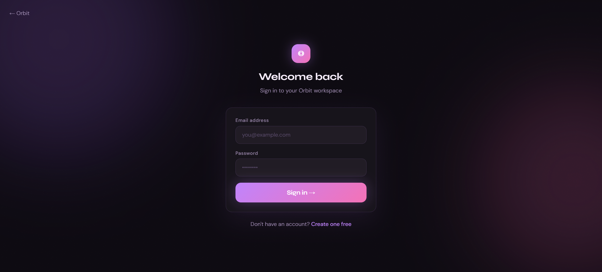
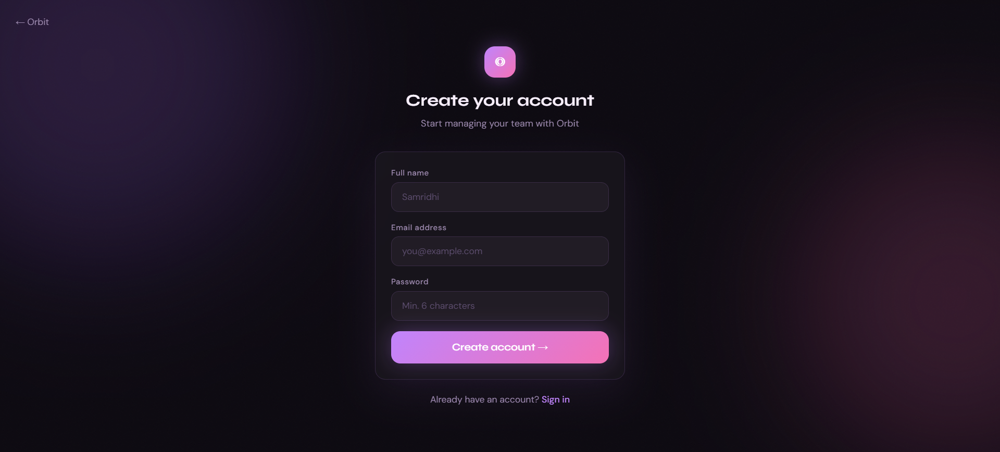
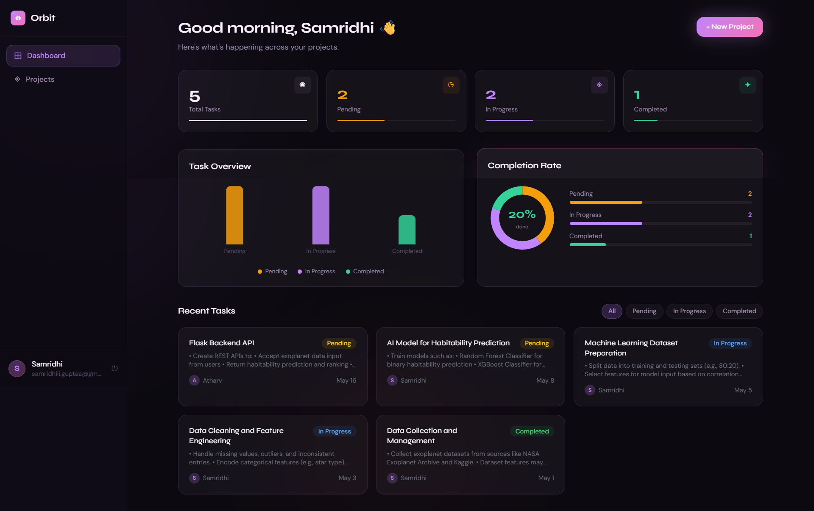
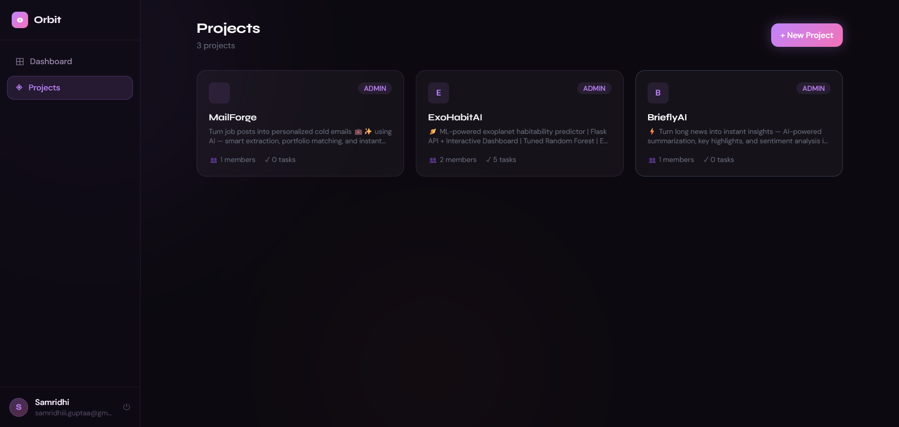

<div align="center">


<br/><br/>

<h1>◎ Orbit</h1>

### **Organize your team. Track every task. Ship faster.**

*A production-ready, full-stack Team Task Manager with role-based access, real-time dashboards, and a premium UI — built and deployed in under 48 hours.*

<br/>

**[🌐 Live Demo](https://orbit-production-76b4.up.railway.app) · [📂 GitHub Repo](https://github.com/SamridhiiiGupta/Orbit) · [⚙️ API Health](https://orbit-production-e491.up.railway.app/api/health)**

<br/>

</div>

---

## 📸 Screenshots

<div align="center">

### 🏠 Landing Page
*Premium SaaS-style landing with animated particles, live activity feed, and scroll-reveal sections*


<br/>

### 🔐 Authentication
*Clean sign-in and registration flow with warm gradient aesthetic*

| Sign In | Create Account |
|:---:|:---:|
|  |  |

<br/>

### 📊 Dashboard
*Animated stat cards, bar chart, donut completion ring, overdue alerts, and filterable task list*



<br/>

### 📁 Projects
*All your projects at a glance — with member count, task count, and role badges*



</div>

---

## ✨ Features

### 🔐 Core Features
- **JWT Authentication** — Secure signup/login with bcrypt password hashing and 7-day token expiry
- **Project Management** — Create, update, and delete projects with name and description
- **Team Management** — Add team members by email, assign roles (Admin / Member)
- **Task System** — Create tasks, assign to members, set due dates, and track status (Pending → In Progress → Completed)
- **Dashboard** — Real-time overview of all tasks across all projects, status breakdown, and overdue detection
- **Role-Based Access Control** — Admins have full control; Members can only update status of their own tasks

### 🧠 Advanced Features
- **Overdue Detection** — Automatically flags tasks past due date that aren't completed
- **Cross-Project Dashboard** — Aggregates tasks from all projects into one view
- **Member Safety Guards** — Prevents removing the last admin from a project
- **Cascading Deletes** — Deleting a project removes all its tasks and memberships cleanly
- **Single-Command Dev** — Frontend + backend start together with one `npm run dev` from root

### 🎨 UX Features
- **Animated Landing Page** — Canvas particle system, floating orbs, grain overlay, scroll-reveal sections
- **Count-Up Stat Cards** — Numbers animate from 0 on page load
- **Donut Completion Chart** — Visual completion percentage with animated progress bars
- **3D Card Tilt** — Feature cards respond to mouse movement with perspective tilt
- **Live Activity Feed** — Simulated real-time team activity on the landing page
- **Filter Tabs** — Filter recent tasks by status directly on the dashboard
- **Skeleton Loading** — Smooth loading states instead of blank screens
- **Auto Browser Launch** — `npm run dev` opens the browser automatically

---

## 🛠️ Tech Stack

| Layer | Technology | Purpose |
|---|---|---|
| **Frontend** | React 18 + Vite | UI framework + lightning-fast dev server |
| **Styling** | Tailwind CSS | Utility-first styling |
| **Charts** | Recharts | Bar chart + Donut/Pie chart on dashboard |
| **Routing** | React Router v6 | Client-side navigation + protected routes |
| **HTTP Client** | Axios | API calls with JWT interceptor + auto-logout |
| **Backend** | Node.js + Express | REST API server |
| **ORM** | Prisma | Type-safe database access + migrations |
| **Database** | PostgreSQL (Railway) / SQLite (dev) | Relational data storage |
| **Auth** | JWT + bcryptjs | Stateless authentication |
| **Dev Tools** | Nodemon + Concurrently | Hot reload + unified dev command |
| **Deployment** | Railway | Full-stack cloud deployment |

---

## 🏗️ Architecture

```
┌─────────────────────────────────────────────────────────┐
│                     CLIENT (Browser)                     │
│              React + Vite  (port 5173)                   │
│   Landing → Auth → Dashboard → Projects → ProjectDetail  │
└──────────────────────┬──────────────────────────────────┘
                       │ HTTP (Axios + JWT)
                       │ /api/*
┌──────────────────────▼──────────────────────────────────┐
│                  BACKEND (Express)                        │
│                  Node.js  (port 5000)                    │
│                                                          │
│  /api/auth     →  AuthController    (register, login)   │
│  /api/projects →  ProjectController (CRUD)              │
│  /api/tasks    →  TaskController    (CRUD + dashboard)  │
│  /api/members  →  MemberController  (add/remove/roles)  │
│                                                          │
│  Middleware: JWT verification → Role guard              │
└──────────────────────┬──────────────────────────────────┘
                       │ Prisma ORM
┌──────────────────────▼──────────────────────────────────┐
│                    DATABASE                               │
│        PostgreSQL (Railway prod) / SQLite (dev)          │
│                                                          │
│   Users ──< ProjectMembers >── Projects                  │
│                                     └──< Tasks           │
└─────────────────────────────────────────────────────────┘
```

### Data Flow
1. User logs in → JWT issued → stored in `localStorage`
2. Every API request → Axios attaches JWT in `Authorization: Bearer` header
3. Express middleware verifies JWT → attaches `req.user`
4. Role middleware checks `ProjectMember.role` before sensitive operations
5. Prisma executes DB queries → returns typed data
6. Frontend renders with React state

---

## 📁 Folder Structure

```
orbit/
├── package.json               ← Root: runs both frontend + backend
│
├── backend/
│   ├── prisma/
│   │   └── schema.prisma      ← DB models (User, Project, Task, Member)
│   ├── src/
│   │   ├── controllers/
│   │   │   ├── auth.controller.js
│   │   │   ├── project.controller.js
│   │   │   ├── task.controller.js
│   │   │   └── member.controller.js
│   │   ├── middleware/
│   │   │   ├── auth.middleware.js   ← JWT verification
│   │   │   └── role.middleware.js   ← Admin/Member guard
│   │   ├── routes/
│   │   │   ├── auth.routes.js
│   │   │   ├── project.routes.js
│   │   │   ├── task.routes.js
│   │   │   └── member.routes.js
│   │   ├── lib/
│   │   │   └── prisma.js            ← Prisma client singleton
│   │   └── index.js                 ← Express entry point
│   ├── .env
│   ├── railway.toml                 ← Railway deployment config
│   └── package.json
│
└── frontend/
    ├── src/
    │   ├── api/
    │   │   └── client.js            ← Axios instance + interceptors
    │   ├── components/
    │   │   ├── Layout.jsx           ← Sidebar navigation
    │   │   ├── Modal.jsx            ← Reusable modal
    │   │   └── TaskCard.jsx         ← Task display card
    │   ├── context/
    │   │   └── AuthContext.jsx      ← Global auth state
    │   ├── pages/
    │   │   ├── Landing.jsx          ← Public landing page
    │   │   ├── Login.jsx
    │   │   ├── Register.jsx
    │   │   ├── Dashboard.jsx        ← Stats + charts + tasks
    │   │   ├── Projects.jsx         ← Projects list
    │   │   └── ProjectDetail.jsx    ← Tasks + members management
    │   ├── App.jsx                  ← Routes + auth guards
    │   └── main.jsx
    ├── index.html
    ├── vite.config.js
    └── package.json
```

---

## 🚀 Getting Started

### Prerequisites
- Node.js v18+
- npm v8+
- Git

### Installation

```bash
# 1. Clone the repository
git clone https://github.com/SamridhiiiGupta/Orbit.git
cd Orbit

# 2. Install all dependencies (frontend + backend)
npm run install:all

# 3. Set up environment variables
cp backend/.env.example backend/.env
# Edit backend/.env with your values (see Environment Variables below)

# 4. Initialize the database
cd backend
npx prisma db push
cd ..

# 5. Start the full app (one command)
npm run dev
```

The app will open automatically at **http://localhost:5173**

---

## ▶️ Running the Project

### Single command from root:
```bash
npm run dev
```

This uses `concurrently` to:
- Start the **Express backend** on `http://localhost:5000`
- Start the **Vite frontend** on `http://localhost:5173`
- Auto-opens the browser

### Individual services:
```bash
# Backend only
cd backend && npm run dev

# Frontend only
cd frontend && npm run dev
```

---

## 🔐 Environment Variables

### Backend (`backend/.env`)

```env
# Database
DATABASE_URL="file:./dev.db"           # SQLite for local dev
# DATABASE_URL="postgresql://..."      # PostgreSQL for production

# Auth
JWT_SECRET="your-secret-key-here"      # Used to sign/verify JWT tokens

# Server
PORT=5000                               # Express server port

# CORS
CLIENT_URL="http://localhost:5173"      # Frontend URL (exact match required)
```

### Frontend (`frontend/.env`)

```env
# Only needed for production deployment
# In local dev, Vite proxy handles /api → localhost:5000
VITE_API_URL="https://your-backend.railway.app"
```

---

## 🌐 Deployment (Railway)

### Backend

1. Push code to GitHub
2. Go to [railway.app](https://railway.app) → New Project → Deploy from GitHub
3. Set **Root Directory** → `backend`
4. Add **PostgreSQL** plugin (Railway auto-sets `DATABASE_URL`)
5. Update `prisma/schema.prisma`: `provider = "sqlite"` → `provider = "postgresql"`
6. Set environment variables:
   ```
   JWT_SECRET=your-secret
   CLIENT_URL=https://your-frontend.railway.app
   PORT=5000
   ```
7. Railway runs: `prisma generate && prisma db push && node src/index.js`

### Frontend

1. New Railway service → same repo → Root Directory: `frontend`
2. Build command: `npm run build`
3. Start command: `npx serve dist -l $PORT`
4. Set variable: `VITE_API_URL=https://your-backend.railway.app`

### Common Mistakes
| Mistake | Fix |
|---|---|
| `prisma: Permission denied` | Remove `node_modules` from git, add to `.gitignore` |
| CORS error | `CLIENT_URL` must exactly match frontend URL with `https://` |
| Blank frontend | Check `VITE_API_URL` is set correctly |
| DB connection error | Add `DATABASE_URL` as a Railway reference, not manual text |

---

## 📡 API Reference

### Auth
| Method | Endpoint | Auth | Description |
|---|---|---|---|
| POST | `/api/auth/register` | ❌ | Create account |
| POST | `/api/auth/login` | ❌ | Login, returns JWT |
| GET | `/api/auth/me` | ✅ | Get current user |

### Projects
| Method | Endpoint | Role | Description |
|---|---|---|---|
| GET | `/api/projects` | Any | List user's projects |
| POST | `/api/projects` | Any | Create project |
| GET | `/api/projects/:id` | Member | Get project details |
| PATCH | `/api/projects/:id` | Admin | Update project |
| DELETE | `/api/projects/:id` | Admin | Delete project |

### Tasks
| Method | Endpoint | Role | Description |
|---|---|---|---|
| GET | `/api/tasks/dashboard` | Any | Cross-project dashboard data |
| GET | `/api/tasks/project/:id` | Member | List project tasks |
| POST | `/api/tasks/project/:id` | Member | Create task |
| PATCH | `/api/tasks/:id` | Member* | Update task |
| DELETE | `/api/tasks/:id` | Admin | Delete task |

*Members can only update status of tasks assigned to them.

### Members
| Method | Endpoint | Role | Description |
|---|---|---|---|
| GET | `/api/members/:projectId` | Member | List members |
| POST | `/api/members/:projectId` | Admin | Add member by email |
| PATCH | `/api/members/:projectId/:userId` | Admin | Change role |
| DELETE | `/api/members/:projectId/:userId` | Admin | Remove member |

---

## ⚡ Performance & Optimizations

- **Prisma WAL mode** — SQLite uses Write-Ahead Logging for better concurrent read performance
- **JWT stateless auth** — No server-side sessions; scales horizontally
- **Vite proxy** — In dev, `/api` requests proxy to backend avoiding CORS entirely
- **Cascading deletes** — Single DB operation cleans up all related records
- **Prisma singleton** — Single PrismaClient instance reused across all requests
- **React lazy state** — Dashboard data fetched once per mount, no polling

---

## 🔭 Future Improvements

- [ ] **Email notifications** — Notify assignees when tasks are created or updated
- [ ] **File attachments** — Upload files to tasks (S3/Cloudinary)
- [ ] **Activity log** — Full audit trail per project
- [ ] **Kanban view** — Drag-and-drop board alongside list view
- [ ] **Task comments** — Threaded discussion per task
- [ ] **Due date reminders** — Scheduled emails for upcoming deadlines
- [ ] **OAuth** — Login with Google / GitHub
- [ ] **Mobile app** — React Native client

---

## 👩‍💻 Author

<div align="center">

**Samridhi Gupta**

[](https://github.com/SamridhiiiGupta/Orbit)

*Built solo in under 24 hours as a full-stack assignment.*

</div>

---

<div align="center">

**◎ Orbit** — Built for teams that move fast.

</div>
